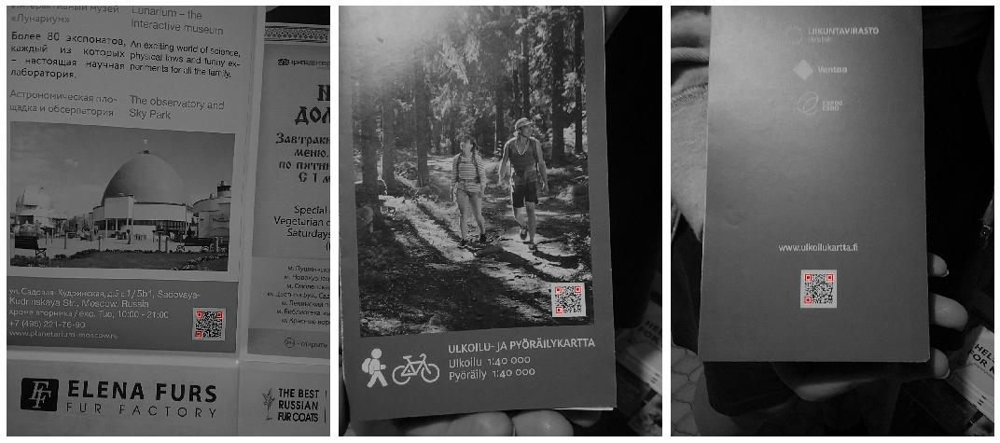
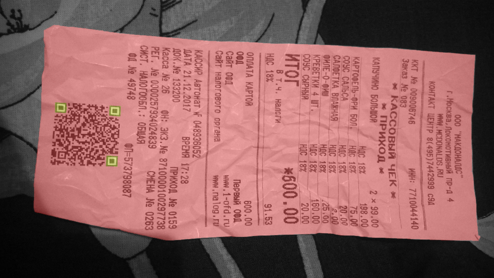
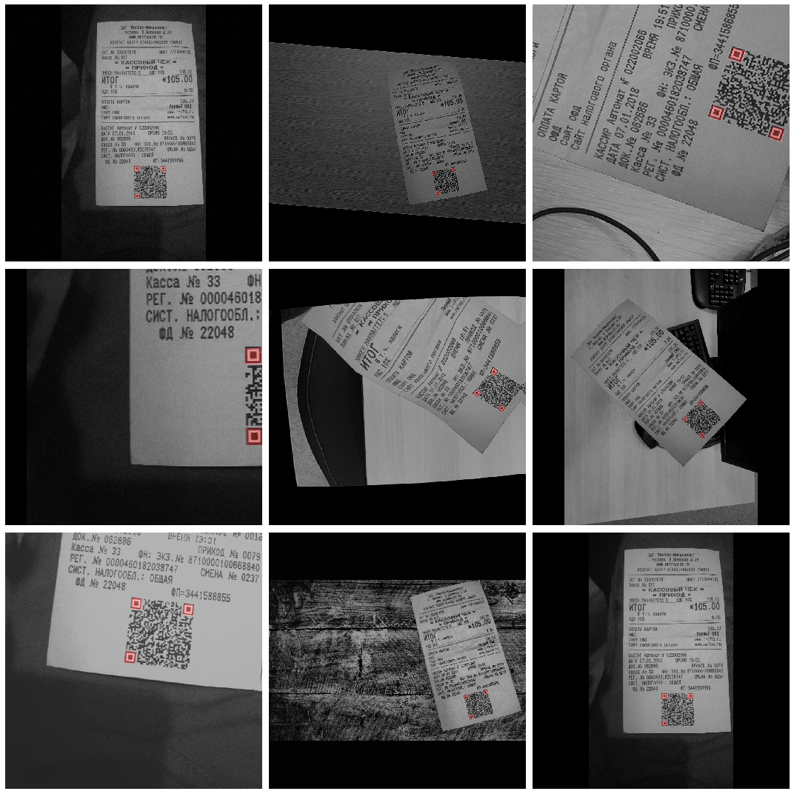
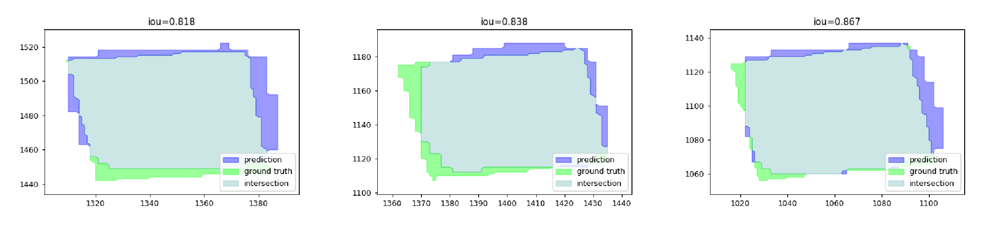

# Caption-Detection
ABBYY Computer Vision Homework Solution

Solution of the problem of pattern detection on a QR code. 
Datasets are available [here](https://drive.google.com/open?id=1VXpGMbfL-5qdzQN2z4bWsz21ojvnPdZv)


### Examples on out of domain images: 
(patterns are masked in red.)


#### Usage:
```
git clone https://github.com/Dokholyan/Caption-Detection.git
cd Caption-Detection
pip install -r requirements.txt
sudo apt install python3-rtree #it is need for metrics functions
```

### Solution
The solution consists of several stages:

1)Made pixel-perfect annotation, it was labeled both QR-code caption and checklist.
The last will be used for augmentation. 

Example:


2)Dataset augmentation, using common "albumentations" augmentation and
image blending(impose checks on different backgrounds)

Example:


3)Instead of directly detecting patterns, semantic segmentation was used. FPN was chosen as a model 
with mobilnet_v2(only 2M params) as a backbone. Catalyst&Pytorch were used.
Some details:
* Linear combination of IOU, BCE, and Dice loss was used as a loss function.
* Model encoder was pretrained on "imagenet",
 so less learning rate in encoder than in decoder was used.
* In order to make the model faster and lighter, it was traced.

4)Morphological transformations like erosion and dilatation were used to extract clean caption boxes
and contours from output mask. 


### Final result:

After contours extraction, it is possible to calculate object detection statistics like TP, FP, FN between prediction contours,
and ground contours truth by IOU measure. 

__Note:__ It is not typical object detection metrics because counters, not rectangles, are compared.
The examples you can see hereunder



Object detection metrics on test dataset:

IOU threshold  | 0.5| 0.6| 0.7| 0.8|
--- | --- | ---| ---|---|
precision | 0.978| 0.978| 0.978| 0.674|
recall| 1.0| 1.0| 1.0| 0.689|
f_score| 0.989|0.989|0.989| 0.681|

For simple patterns detection on a check, it is enough to use a simple segmentation model
(only 2M parameters). It is easy to see from the examples, the masks turned out to be somewhat rude.

__There are several ways to improve the solution:__
    
1) Segmentate also QR-code, so it is possible to ignore prediction out of QR code

2) Use more complicated post-processing, because knowing two of the three patterns you can restore the third one

3) Create more various augmentation, for example, put  QR-code on different documents
(for example [DDI-100](https://github.com/machine-intelligence-laboratory/DDI-100) dataset)

### File description:
- Experiment.ipynb: main experiment file
- annotations_utils.py: utils to annotate source dataset
- labelme_utils.py: utils to work with labelme format
- blending.py: functions to blend images(in order to change background)
- boxes_utils.py: utils to works with different boxes format
- post_processing.py: function to post-process model output masks to extract boxes and counters
- metrics.py: functions to calculate object detections metrics in order to evaluate model
- show_utils.py: functions to draw images
- image_utils.py: some image utils
- requirements.txt: requirements file
- trace/: directory with traced models